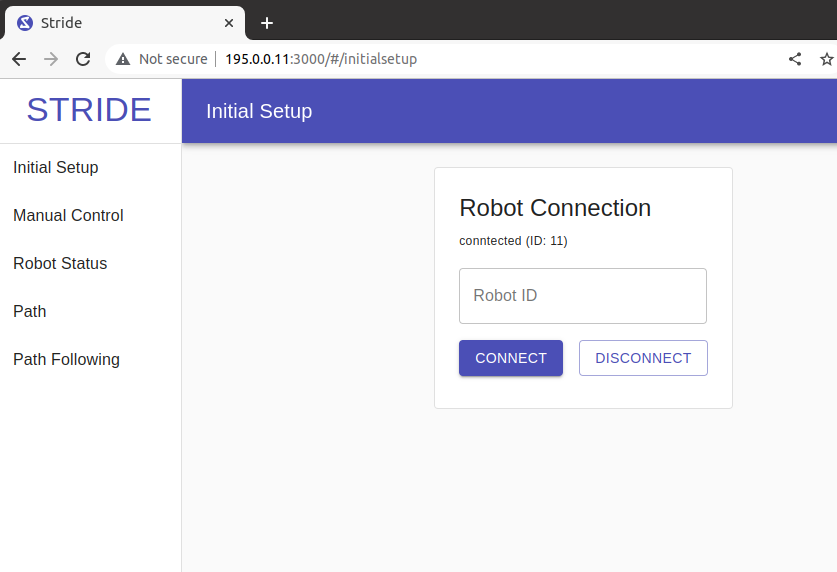

# STRIDE

## Table of Content

I. Build Workspace
II. How to run on target robot?
III. Vehicle info output
IV. Updating Code
V. Collect data
VI. Directory Structure

---


## I. Build Workspace
This section details how to set up the workspace for STRIDE. Meant for developers familiar with Git. 

```
cd ~
git clone https://github.com/sealtd-robotics/stride_ros.git
cd ~/stride_ros/

# if first time cloning the folder
git submodule update --init --recursive

## OR if anything goes wrong and the git submodule command above does not work
rm -rf stride_ws/src/oxford_gps_decoder
rm -rf stride_ws/src/oxford_gps_eth
rm -rf stride_ws/src/sbg_ros_driver
git submodule init
git submodule update

## Install dependencies, should need to do this only once on the same machine
./bash/dep_install.sh

## Build workspace
./bash/build_ws.sh
```

If submodule is updated, pull latest changes in the submodules:

```
cd ~/stride_ros
git submodule update --recursive
```

For developer, pull the latest commit of the submodule into project

```
cd ~/stride_ros
git submodule update --remote --merge
git add stride_ros/<submodule_name>
git commit -m "content of your commit"
git push
```

## II. How to run on target robot?

This section details setting up STRIDE's GUI. STRIDE uses the auto approach by default. 

1. The Auto approach

   ***Note**: the services below are designed for SEA's provided hardware running on STRIDE.*
   &nbsp;
   Enable the systemd services to take care of the steps above. So everytime the robot is booted up, it will automatically spin up webserver, set up can bus and roslaunch top level file within target robot.

   ```
   sudo ./system/enable_webserver.sh
   sudo ./system/enable_services.sh
   ```

   To disable all services and remove systemd services

   ```
   sudo ./system/disable_webserver.sh
   sudo ./system/disable_services.sh
   ```

2. The manual approach

   Spin up the webserver first to get access to gui:

   ```
   python3 ./system/web_server_for_gui.py
   ```

   Then the web gui can be accessed with `ip_address:3000` from browser of pc connect to the network. `ip_address` is the address of machine runs the web server.
   &nbsp;
   

   Then, launch ALL nodes. Don't forget to source the workspace.

   ```bash
   roslaunch top_level top_level.launch
   ```

## III. Vehicle info output

   This is for the target vehicle that needs to sync with STRIDE in test. We provide a solution to read GPS from the vehicle and output vehicle's gps information to our network. Vehicle boxes are set up as autoboot. 

   1. The Auto approach

      Enable the systemd services to configure CAN bus and roslaunch `target_vehicle.launch` at boot.
      ```
      sudo ./system/enable_target_services.sh
      ```

      To disable the services above:
      ```
      sudo ./system/disable_target_services.sh
      ```
   
   2. The manual approach
      Make sure to enable CAN bus:
      ```
      sudo ./system/can_setup.sh
      ```
      Roslaunch all the required nodes:
      ```
      roslaunch top_level target_vehicle.launch
      ```

## IV. Updating code
This section details how to put code updates onto STRIDE.

**For a standard release, do the following:**
1. Navigate the GitHub for STRIDE to "Releases" and download the zip file for the desired code version. 
2. Connect computer to STRIDE's rocket network
3. Navigate to where the zip file was downloaded and then copy it to STRIDE
   
   **Syntax:** 
   ```
   cd  <filepath>
   scp -r stride_ros-1.0.0.zip nvidia@<Robot IP Address>:
   ```

   **Example:** 
   ```
   cd home/stride
   scp -r stride_ros-1.0.0.zip nvidia@195.0.0.10:
   ```
4. ssh into Stride.
   
   **Syntax:** 
   ```
   ssh nvidia@<STRIDE IP Address>
   ```

   **Example:**
   ``` 
   ssh nvidia@195.0.0.10
   ```
5. Unzip the zip file.
   
   **Syntax:** 
   ```
   unzip <filename.zip>
   ```

   **Example:**
   ``` 
   unzip stride_ros-1.0.0.zip
   ```
6. Navigate to bash folder and run update_software.sh
   
   **Syntax:**
   ``` 
   cd <unzipped filename>/bash
   ./update_software.sh
   ```

   **Example:**
   ``` 
   cd stride_ros-1.0.0/bash
   ./update_software.sh
   ```
7. Rebuild the workspace
   ```
   ./build_ws.sh
   ```

**If the release requires changes outside of the src folder, then do the following: (The release will specify if this is needed instead)**
1. Follow steps 1 through 5 the same as above.
2. Remove the old stride_ros folder
   ```
   rm -rf stride_ros
   ```
3. Rename the unipped release to stride_ros
   
   **Syntax:**
   ```
   mv <unzipped filename> stride_ros
   ```

   **Example:**
   ``` 
   mv stride_ros-1.0.0 stride_ros
   ```
4. Follow step 7 from above

**To update the parameters file, do the following:**
1. In file explorer, navigate to the file params.yaml and open it.
   stride_ros -> stride_ws -> params -> params.yaml
2. Change the desired parameters and save the file.
3. Connect computer to STRIDE's rocket network.
4. Copy the params folder to STRIDE.
   
   **Syntax:**
   ``` 
   cd stride_ros/stride_ws
   scp -r params/* nvidia@<STRIDE IP Address>:~/stride_ros/stride_ws/params
   ```

   **Example:**
   ``` 
   cd stride_ros/stride_ws
   scp -r params/* nvidia@195.0.0.10:~/stride_ros/stride_ws/params
   ```

## V. Collect Data

When a test is trigged with state AUTO (value 2) in the `overseer/state` topic, the `data_record_node` starts recording until the state is out of AUTO (will record from test start to test end). Data can then be downloaded from the GUI. Download this data before starting another test, or the data file will be overwritten. 

A way to manually start a recording is as follows:
`rostopic pub /cmd/record std_msgs/Bool true -1`

To stop a manual recording:
`rostopic pub /cmd/record std_msgs/Bool false -1`

Manual record has higher priority than state mode. Once `/cmd/record` is published `true`, no other mode can turn it off until `/cmd/record` is published `false`. This mode will allow for recording data outside of a test. **Use carefully and don't forget to turn it off.**

Data is saved in `stride_ros/stride_ws/test_log/data.csv`. Make sure to download the data after each recording (either by ssh copy or using our web GUI download feature), or it will be overwritten in the next recording.

## VI. Directory Structure

```
.
├── bash                                # Include scripts to help build project and dependencies
├── example_scripts                     # Include some example scripts to help user getting started to setup robot test
├── stride_gui_build                    # Binary build of our web gui
├── stride_ws                           # Main ROS workspace
│   ├── custom_script                   # Where the test script is stored
│   ├── params                          # Location to parameters and config files
│   ├── path                            # Location to test path files
│   ├── src
│   │   ├── can_interface               # Can interface interact with low level hardware
│   │   ├── descender                   # Safety on slope
│   │   ├── drive_mechanism             # Control
│   │   ├── external_interface          # Interface with external vehicle
│   │   ├── joystick                    
│   │   ├── networking                  # Everything networking
│   │   ├── overseer                    # Top level state machine manager
│   │   ├── oxford_gps_decoder          # Python driver to read Oxts GPS through CANbus and Ethernet
│   │   ├── path_follower               # Path following algos
│   │   ├── robot_commander             # Process test setup and execution
│   │   ├── sbg_ros_driver              # submodule to SBG GPS driver
│   │   ├── shared_tools                # misc
│   │   └── top_level                   # top level launch files
│   └── test_log                        
└── system                              # Systemd files
```
