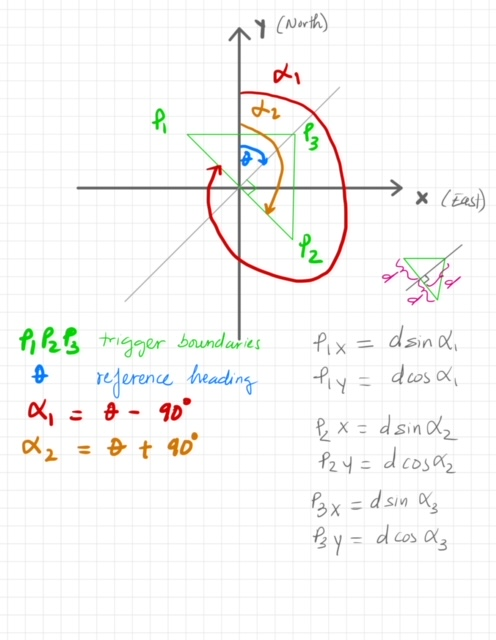

### Position Boundary
Require __*reference*__ heading, latitude, longitude to the location that the robot is waiting for the target vehicle to pass.

With referenced heading, the vertices of a triangle boundary can be calculated as below assuming reference latitude and longitude is the East-North origin. 

__d__ (meters) is an assigned value to calculate how large the triangle should be.

### In Boundary Check
With live update global position from target, local East-North coordinates are calculated and checked to whether the vehicle has enter the boundary. 
Method of checking is according to this article: https://blackpawn.com/texts/pointinpoly/

